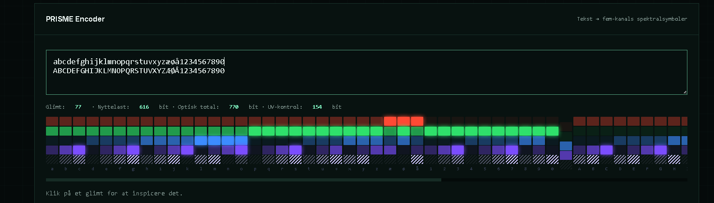

   

> :denmark: [Laes paa dansk](README.da.md)

# PRISME -- Five-channel spectral data storage

> **Store data in coloured light.** Five colours, four intensity levels, ten bits per flash.  
> The fifth channel is invisible to the eye but doubles the error correction.  
> The medium is glass, draws zero power at rest, and lasts for millennia.

---
## ESP32-S3 Controller Simulator

Run the PRISME ESP32-S3 controller simulation directly in Wokwi:

[Open the PRISME ESP32-S3 Controller Simulator](https://wokwi.com/projects/471448316897809409)

The simulator includes the five spectral outputs (R, G, B, Violet and UV/control), an ILI9341 status display, local Start/Stop/Test controls, serial JSONL communication, simulated readback and CRC32 verification.

> This is a laboratory software simulation. It does not represent validated physical optical timing, laser control or glass-writing performance.
---
## Try it now

[▶ Open the PRISME glass plate demo](https://janus5g.github.io/PRISME/demo/prisme.html)

Write assembly code, see each character as a light flash across five colour channels, and run programs on the virtual machine. Everything runs locally in the browser.


---

## Documentation

| Document | Audience | Download |
|----------|----------|----------|
| [Complete Guide](docs/PRISME_Komplet_Guide.docx) | Everyone -- 17 pages with shopping list and datacenter calculations | `.docx` (Google Docs compatible) |
| [Hardware Schematic v2](docs/PRISME_v2_Hardwareskematik.docx) | Engineers / researchers -- 14 pages with component specifications | `.docx` (Google Docs 
compatible) |
| [University Validation Proposal](docs/PRISME_University_Validation_Proposal.docx) | DTU / university labs -- independent proof-of-concept protocol with testable hypotheses | `.docx` |
---

## What is PRISME?

PRISME is an optical data storage system that uses five wavelengths of light with four intensity levels each to store data in glass plates. Where a CD uses one laser with two states (1 bit), PRISME uses five simultaneous channels with four levels -- **10 bits per light flash**.

| Channel | Colour | Wavelength | Role | Bits |
|---------|--------|------------|------|------|
| R | Red | 630 nm | Data (bit 7-6) | 2 |
| G | Green | 530 nm | Data (bit 5-4) | 2 |
| B | Blue | 470 nm | Data (bit 3-2) | 2 |
| V | Violet | 410 nm | Data (bit 1-0) | 2 |
| UV | Ultraviolet | 405 nm | Error control | 2 |

Four data channels x 4 levels = **4^4 = 256 states = 1 byte**. The full character set in a single flash. The UV channel carries `(R+G+B+V) mod 4` and doubles the Reed-Solomon error correction capacity.

---

## Connection to Chromaplex OS

PRISME is the physical layer beneath [Chromaplex OS](https://github.com/search?q=chromaplex-os). Chromaplex defines the abstract data structure -- facets, depths, numeric payloads. PRISME defines *how* that data is written and read in glass:

```
+--------------------------------------------------+
|  Chromaplex OS v1/v2                             |
|  Abstract: facets, depths, NPP payloads          |
|  Format: ChromaBridge numeric protocol           |
+------------------------+-------------------------+
                         |
                         v
+--------------------------------------------------+
|  PRISME -- spectral encoder                      |
|  Translates bytes to five-channel light flashes   |
|  Adds UV checksum and RS error coding             |
|  Packs into OPTB v1 binary format with CRC32      |
+------------------------+-------------------------+
                         |
                         v
+--------------------------------------------------+
|  Physical medium                                 |
|  5 curved dichroic glass plates                   |
|  4 x 100 um air gaps                              |
|  Voxels at 1 um spacing -- 100 MB/cm2             |
|  Power at rest: 0 W                               |
+--------------------------------------------------+
```

---

## Repository contents

```
PRISME/
+-- README.md                            <-- this file (English)
+-- README.da.md                         <-- Danish version
+-- LICENSE                              <-- MIT
+-- start-ors.bat                        <-- starts the simulator on Windows
+-- optical-routing-simulator.zip        <-- physics simulator (Python/FastAPI)
|
+-- docs/                                <-- GitHub Pages + documentation
|   +-- index.html                       <-- PRISME demo (GitHub Pages)
|   +-- PRISME_Komplet_Guide.docx        <-- complete guide
|   +-- PRISME_v2_Hardwareskematik.docx  <-- technical document
|
+-- demo/
|   +-- prisme.html                      <-- assembler and VM (open locally)
|
+-- tests/
    +-- test_prisme.py                   <-- 41 tests
```

<details>
<summary>Simulator contents (click to expand)</summary>

```
optical-routing-simulator/
+-- pyproject.toml
+-- Dockerfile
+-- Makefile
+-- src/optical_router/
|   +-- physics.py          <-- Sellmeier dispersion, Arrhenius retention
|   +-- compiler.py         <-- OPTB v1 binary compiler with CRC32
|   +-- api.py              <-- FastAPI: /simulate/write, /simulate/stream, /prisme
|   +-- constants.py        <-- physical constants (Boltzmann, Sellmeier coefficients)
|   +-- models.py           <-- Pydantic data models
|   +-- service.py          <-- business logic
|   +-- errors.py           <-- error handling
|   +-- static/
|       +-- index.html      <-- dashboard with PRISME encoder
|       +-- prisme.html     <-- assembler (also via /prisme)
+-- tests/                  <-- 19 tests (physics, compiler, API)
+-- examples/               <-- sample requests (JSON)
```

</details>

---

## Quick start

### 1. Browser demo (no installation)

**Online:** [**Open PRISME demo**](https://Janus5G.github.io/PRISME/) -- runs directly in the browser.

**Locally:** Download and open `demo/prisme.html` in your browser.

### 2. Run the full physics simulator

#### Linux / macOS / WSL (recommended)

```bash
git clone https://github.com/Janus5G/PRISME.git
cd PRISME
unzip optical-routing-simulator.zip -d ors
cd ors
python3 -m venv .venv
source .venv/bin/activate
pip install -e ".[dev]"
python3 -m optical_router --reload
```

Open in browser:
- `http://127.0.0.1:8000` -- dashboard with PRISME encoder and physics simulator
- `http://127.0.0.1:8000/prisme` -- assembler and VM

Stop with `Ctrl+C`.

#### Without git (direct download)

```bash
wget https://github.com/Janus5G/PRISME/archive/refs/heads/main.zip -O prisme.zip
unzip prisme.zip
cd PRISME-main
unzip optical-routing-simulator.zip -d ors
cd ors
python3 -m venv .venv
source .venv/bin/activate
pip install -e ".[dev]"
python3 -m optical_router --reload
```

#### Windows (PowerShell)

```powershell
git clone https://github.com/Janus5G/PRISME.git
cd PRISME
Expand-Archive -Path optical-routing-simulator.zip -DestinationPath ors -Force
cd ors
py -m venv .venv
.\.venv\Scripts\python.exe -m pip install -e ".[dev]"
.\.venv\Scripts\python.exe -m optical_router --reload
```

Or double-click `start-ors.bat` in the simulator folder.

#### Run tests

```bash
python tests/test_prisme.py           # 41 PRISME tests
cd ors && pytest -v                   # 19 simulator tests (physics, compiler, API)
```

---

## How it works

### Byte to light flash

Any byte (0-255) is encoded as four quaternary digits plus a checksum:

```
Byte 72 ("H"):

  72 / 64 = 1 remainder 8    ->  R = 1 (dim)
   8 / 16 = 0 remainder 8    ->  G = 0 (off)
   8 /  4 = 2 remainder 0    ->  B = 2 (medium)
   0                          ->  V = 0 (off)
   (1+0+2+0) mod 4 = 3       ->  UV = 3 (full)

Base-4: 1020  |  Hex: 48  |  UV check: 3
```

### UV channel and Reed-Solomon

The UV channel detects corrupt symbols and marks them as **erasures**. Reed-Solomon can correct twice as many erasures as unknown errors. With RS(255,223): 16 parity symbols correct 16 errors *or* **32 erasures**. The "wasted" fifth channel doubles the error correction capacity.

### Plate design

```
    White light in
         |
+----------------------------+
|  Plate 1: RED dichroic     |  0.5 mm glass
+----------------------------+
      ~~~ 100 um air ~~~
+----------------------------+
|  Plate 2: GREEN dichroic   |  0.5 mm glass
+----------------------------+
      ~~~ 100 um air ~~~
+----------------------------+
|  Plate 3: BLUE dichroic    |  0.5 mm glass
+----------------------------+
      ~~~ 100 um air ~~~
+----------------------------+
|  Plate 4: VIOLET dichroic  |  0.5 mm glass
+----------------------------+
      ~~~ 100 um air ~~~
+----------------------------+
|  Plate 5: UV control       |  0.5 mm glass
+----------------------------+
         |
   5 photodiodes measure
   transmitted intensity
```

Total height: ~3 mm. Curved plates (radius ~500 mm) keep light stable in the cavity (Fabry-Perot principle).

---

## Power savings: datacenter calculation

### Per unit

| State | PRISME | SSD | HDD |
|-------|--------|-----|-----|
| Idle | **0 W** | 0.5-1 W | 5-8 W |
| Longevity | 1,000+ years | 5-10 years | 3-5 years |

### 10 PB cold archive -- 1 year

| | HDD (500 x 20 TB) | PRISME |
|---|---|---|
| Idle power | 2,500 W around the clock | 0 W |
| With cooling (PUE 1.4) | 3,500 W | 0 W |
| Energy per year | 30,660 kWh | 0 kWh |
| **Electricity cost/year** | **EUR 6,200 / USD 6,700** | **0** |
| CO2 per year | ~4.9 tonnes | 0 tonnes |

### Over time

| Timeframe | HDD (power + hardware) | PRISME | Savings |
|-----------|------------------------|--------|---------|
| 1 year | EUR 6,200 | 0 | EUR 6,200 |
| 5 years | EUR 200,000 | 0 | ~EUR 200,000 |
| 10 years | EUR 400,000 | 0 | ~EUR 400,000 |

---

## Instruction set

Opcode and operands encoded across four visible channels: `R = class, G = operation, B = destination, V = source`.

| R.G | Instruction | Effect |
|-----|-------------|--------|
| 0.0 | `NOP` | No operation |
| 0.1 | `HALT` | Stop the machine |
| 0.2 | `OUT r` | Print register as character |
| 0.3 | `EMIT r` | Print register as number |
| 1.0 | `ADD d, s` | d = d + s |
| 1.1 | `SUB d, s` | d = d - s |
| 1.2 | `MUL d, s` | d = d * s |
| 1.3 | `XOR d, s` | d = d ^ s |
| 2.0 | `SET d, #n` | d = constant |
| 2.1 | `MOV d, s` | d = s |
| 2.2 | `LOAD d, [s]` | d = memory[s] |
| 2.3 | `STORE [d], s` | memory[d] = s |
| 3.0 | `JMP addr` | Jump to address |
| 3.1 | `JZ addr` | Jump if zero flag |
| 3.2 | `JNZ addr` | Jump if not zero flag |
| 3.3 | `CMP d, s` | Compare, set zero flag |

4 registers (A, B, C, D) -- 256 bytes memory -- one instruction per light flash.

---

## Physics simulator

| Module | Computes |
|--------|----------|
| `physics.py` | Sellmeier dispersion, spherical aberration, Arrhenius retention, peak intensity |
| `compiler.py` | Quantisation, OPTB v1 binary with CRC32, transmission timing |
| `api.py` | `/simulate/write` (write validation) and `/simulate/stream` (binary compilation) |

### Verified channel indices

| Channel | Tabulated | Computed (Sellmeier) | Deviation |
|---------|-----------|----------|-----------|
| R 630 nm | 1.4580 | 1.4571 | 0.06% |
| G 530 nm | 1.4613 | 1.4608 | 0.03% |
| B 470 nm | 1.4650 | 1.4641 | 0.06% |
| V 410 nm | 1.4701 | 1.4691 | 0.07% |
| UV 405 nm | 1.4706 | 1.4696 | 0.07% |

---

## Roadmap

| Phase | Goal | Budget | Time |
|-------|------|--------|------|
| 1 -- Proof of concept | 100 bytes, 4 levels, UV check | ~EUR 900 | 2-3 months |
| 2 -- Automation | 10,000+ voxels, piezo stage, camera readout | ~EUR 3,500-5,500 | 3-6 months |
| 3 -- Permanent medium | Femtosecond laser writing in fused silica | ~EUR 14,000-34,000 | 6-12 months |
| 4 -- Production | 20 units in rack, networking, sharding | ~EUR 70,000+ | 12+ months |

Phase 3 requires access to a femtosecond laser -- collaboration with DTU Photonics or a similar institution is the most direct path.

---

## Shopping list (prototype)

| Component | Price |
|-----------|-------|
| Raspberry Pi 5 (4 GB) | EUR 80 |
| 4 laser diodes (405-635 nm) | EUR 110 |
| 5 LEDs for readout | EUR 35 |
| 5 bandpass filters (10 nm) | EUR 340 |
| 5 photodiodes (BPW34) | EUR 20 |
| DAC (MCP4728) + ADC (MCP3208) | EUR 15 |
| Microscope slides + SU-8 photoresist | EUR 70 |
| XY micrometre stage | EUR 110 |
| Power supply + cables + enclosure | EUR 135 |
| **Total** | **~EUR 900** |

All components available online. No custom parts required.

---

## PRISME Binary Extension

A separate additive extension documents portable binary packaging,
software-level scaling and integration with customer-controlled systems.

**Convert once. Integrate anywhere.**

[Open PRISME Binary Extension v0.1](https://github.com/Janus5G/PRISME-Binary-Extension)

The extension does not modify the original PRISME optical research concept,
browser prototypes or university validation material.

---

## Related repositories

- [chromaplex-os-compiler](https://github.com/search?q=chromaplex-os-compiler) -- Chromaplex OS compiler
- [Cplex](https://github.com/search?q=Cplex+chromaplex) -- Chromaplex core library
- [chromaplex-os-v2](https://github.com/search?q=chromaplex-os-v2) -- Chromaplex OS version 2
- [ChromaBridge](https://github.com/search?q=ChromaBridge) -- Web3 data migration pipeline with NPP

---

## License

Copyright © 2026 Janus R. All rights reserved.

This repository is published for technical review and documentation purposes only.

No licence is granted to use, reproduce, modify, distribute, sublicense, sell, embed, deploy or commercially exploit the software, specification, binary format, documentation or derivative works without prior written permission from the copyright holder.

No express or implied patent licence is granted.

---

*PRISME -- Store data in coloured light -- July 2026*
